PayGrid `POST`s JSON to your URL when a payment status changes. Use webhooks as the primary integration path; poll `GET /api/v1/payments/{id}` only as a fallback.

## URL resolution

| Source | Applies to |
| :--- | :--- |
| `webhook_url` / `callback_url` on `POST /api/v1/payments` | That payment (overrides merchant defaults) |
| `webhook_url` / `callback_url` on `PUT /api/v1/merchants/me` | Merchant default (used when omitted on the request) |
| Dashboard webhook settings | Same fields as merchant profile; can also send a signed `webhook.test` event to verify your endpoint |

Priority: per-payment value → merchant default → no delivery.

<Warning>
  URLs must be `https://` and publicly reachable — private/internal hosts are rejected, and URLs longer than 2048 characters are invalid. Deliveries to an invalid URL are not retried.
</Warning>

## `webhook_url` vs `callback_url`

| Field | When PayGrid calls |
| :--- | :--- |
| `webhook_url` | **Every** status change (lifecycle events) |
| `callback_url` | **Terminal status only** (`completed`, `failed`, `expired`, `cancelled`) |

Both use the same HMAC signing. Most integrations only need `webhook_url`.

## Payment status lifecycle

After `POST /api/v1/payments`, a payment moves through a fixed set of normalized statuses — these are the only values you will ever see in webhooks and API responses, regardless of payment method.

```mermaid
stateDiagram-v2
    [*] --> pending: Payment created (no webhook)
    pending --> processing: Rare intermediate state
    processing --> completed: Customer authorized; funds captured
    pending --> completed: Customer authorized; funds captured
    pending --> failed: Customer declined / wallet rejected
    pending --> cancelled: Cancelled before completion
    pending --> expired: Not completed within ~30 minutes
    completed --> partially_refunded: Partial refund (no webhook)
    completed --> refunded: Full refund (no webhook)
```



| Status | Terminal? | Meaning |
| :--- | :--- | :--- |
| `pending` | No | Created; awaiting customer action (USSD push, QR scan, card checkout) |
| `processing` | No | Rare/legacy intermediate state — not a standard step for mobile payments |
| `completed` | Yes | Payment successful; merchant balance credited |
| `failed` | Yes | Payment failed (declined or rejected) |
| `cancelled` | Yes | Payment cancelled before completion |
| `expired` | Yes | Payment not completed within ~30 minutes of creation — PayGrid enforces this expiry and delivers `payment.expired` |
| `partially_refunded` | — | One or more partial refunds applied after completion (no webhook emitted) |
| `refunded` | — | Full amount refunded after completion (no webhook emitted) |

Terminal statuses never regress. Once `completed`, `failed`, `cancelled`, or `expired`, the payment will not return to `pending`.

Expiry is enforced by PayGrid: a payment that is still `pending` roughly 30 minutes after creation transitions to `expired` (occasionally slightly later). The payment's final status is verified one last time before expiring, so a payment that actually completed late is honored as `completed`.

## Payment webhook events

Webhooks fire on every status **transition** — not at creation time. There is no `payment.pending` webhook when the payment is created: `pending` is the initial state, so the first webhook you receive is the first transition (usually a terminal status). The `event` field is `{transaction_type}.{new_status}` — for payments:

| Event | `data.status` | Typical `data.previous_status` | When it fires |
| :--- | :--- | :--- | :--- |
| `payment.processing` | `processing` | `pending` | Rare — legacy intermediate state; not a standard step for mobile payments |
| `payment.completed` | `completed` | `pending` | Payment captured successfully |
| `payment.failed` | `failed` | `pending` | Payment was declined or rejected |
| `payment.cancelled` | `cancelled` | `pending` | Payment cancelled |
| `payment.expired` | `expired` | `pending` | Payment not completed within ~30 minutes of creation |

<Note>
  No webhook event is emitted for the refund statuses (`partially_refunded`, `refunded`) currently. Don't build logic that waits for a `payment.partially_refunded` or `payment.refunded` event.
</Note>

<Note>
  Don't assume an intermediate event will precede the terminal one. Only advance your internal order status forward — never backward.
</Note>

Deduplicate with `event_id` — one per status transition, not per transaction. Retries of the same event reuse the same `event_id` (only the `X-MeetPay-Delivery-ID` header changes per attempt).

## Webhook payload

Sent to `webhook_url` on each status change:

```json
{
  "version": "1.0",
  "event": "payment.completed",
  "event_id": "d4f8a1b2-3c4d-5e6f-7a8b-9c0d1e2f3a4b",
  "transaction_id": "f5d238bd-f8ab-4379-9832-0f1ce6d65cbe",
  "merchant_reference": "ORDER_123",
  "data": {
    "amount": 5000,
    "currency": "TZS",
    "status": "completed",
    "previous_status": "pending",
    "payment_type": "mobile",
    "provider_reference": "EXT-20250101-001",
    "completed_at": "2026-06-09T12:54:05Z"
  },
  "metadata": {
    "order_id": "ORD-9876"
  },
  "timestamp": "2026-06-09T12:54:06Z"
}
```

Optional fields (`failure_reason`, `completed_at`, `metadata`) are **omitted** when empty — they are never sent as `null`.

### Webhook fields

| Field | Type | Description |
| :--- | :--- | :--- |
| `version` | string | Payload schema version (`"1.0"`) |
| `event` | string | Event name, e.g. `payment.completed` |
| `event_id` | UUID | Unique per event (status transition); stable across retries — use for deduplication |
| `transaction_id` | UUID | PayGrid payment ID (same as `GET /api/v1/payments/{id}`) |
| `merchant_reference` | string | Your `reference` from payment creation |
| `data.amount` | number | Original payment amount |
| `data.currency` | string | Currency code (`TZS`, `USD`, `KES`, `UGX`) |
| `data.status` | string | New status after this transition |
| `data.previous_status` | string | Status before this transition |
| `data.payment_type` | string | `mobile`, `card`, or `dynamic-qr` |
| `data.provider_reference` | string | Upstream payment reference — quote it in support requests |
| `data.failure_reason` | string | Only on `payment.failed` when a reason is available; omitted otherwise |
| `data.completed_at` | datetime | Present once the payment reaches a terminal status; omitted otherwise |
| `metadata` | object | Your original `metadata` echoed back; omitted when empty |
| `timestamp` | datetime | When PayGrid generated this notification |

### Example: failure event

```json
{
  "version": "1.0",
  "event": "payment.failed",
  "event_id": "a1b2c3d4-e5f6-7890-abcd-ef1234567890",
  "transaction_id": "f5d238bd-f8ab-4379-9832-0f1ce6d65cbe",
  "merchant_reference": "ORDER_123",
  "data": {
    "amount": 5000,
    "currency": "TZS",
    "status": "failed",
    "previous_status": "pending",
    "payment_type": "mobile",
    "provider_reference": "EXT-20250101-001",
    "failure_reason": "Customer declined USSD prompt",
    "completed_at": "2026-06-09T12:54:11Z"
  },
  "timestamp": "2026-06-09T12:54:12Z"
}
```

## Callback payload

Sent to `callback_url` **once** when the payment reaches a terminal status. Simpler shape — no `event` or `previous_status`:

```json
{
  "version": "1.0",
  "type": "transaction.callback",
  "transaction_id": "f5d238bd-f8ab-4379-9832-0f1ce6d65cbe",
  "merchant_reference": "ORDER_123",
  "amount": 5000,
  "currency": "TZS",
  "status": "completed",
  "payment_type": "mobile",
  "provider_reference": "EXT-20250101-001",
  "completed_at": "2026-06-09T12:54:05Z",
  "metadata": {
    "order_id": "ORD-9876"
  },
  "timestamp": "2026-06-09T12:54:06Z"
}
```

As with webhooks, `failure_reason` (failed only), `completed_at`, and `metadata` are omitted when empty; in callbacks `merchant_reference` is also omitted when empty. Deduplicate callbacks with `transaction_id` (one callback per payment).

## Configure on payment create

```bash
curl -X POST "https://meet.briq.tz/api/v1/payments" \
  -H "Authorization: Bearer YOUR_API_KEY" \
  -H "Content-Type: application/json" \
  -H "Idempotency-Key: $(uuidgen)" \
  -d '{
    "amount": 5000,
    "currency": "TZS",
    "type": "mobile",
    "phone": "255712345678",
    "customer": {"firstname": "John", "lastname": "Doe", "email": "john@example.com"},
    "reference": "ORDER_123",
    "webhook_url": "https://api.example.com/paygrid/webhooks",
    "callback_url": "https://api.example.com/paygrid/callback"
  }'
```

Optional: set defaults once via [Merchant default URLs](/guides/merchants/merchant-default-urls) instead of sending them on every payment.

## Signature

| Header | Value |
| :--- | :--- |
| `X-MeetPay-Signature` | `sha256=<hex>` (HMAC-SHA256) |
| `X-MeetPay-Timestamp` | Unix seconds |
| `X-MeetPay-Delivery-ID` | Unique per delivery attempt — quote it in support requests |

Sign input: `{timestamp}.{raw_body}`. The signing key is issued per account — contact support if you don't have yours.

```javascript
const crypto = require('crypto');

function verify(signatureHeader, timestamp, rawBody, signingKey) {
  // Replay protection (recommended): reject events older than 5 minutes
  if (Math.abs(Date.now() / 1000 - parseInt(timestamp, 10)) > 300) {
    return false;
  }
  const expected = crypto
    .createHmac('sha256', signingKey)
    .update(`${timestamp}.${rawBody}`)
    .digest('hex');
  const received = signatureHeader.replace('sha256=', '');
  if (received.length !== expected.length) return false;
  return crypto.timingSafeEqual(Buffer.from(expected), Buffer.from(received));
}
```

## Handler checklist

1. Verify the signature on the **raw request body** (not re-serialized JSON).
2. Return `2xx` within 30 seconds — process business logic asynchronously.
3. Deduplicate webhooks by `event_id`; deduplicate callbacks by `transaction_id`.
4. Confirm `data.amount`, `data.currency`, and `merchant_reference` match your order.
5. Fulfill on `payment.completed`; release inventory / notify customer on `payment.failed` or `payment.expired`.

## Retries and polling fallback

| Scenario | Behavior |
| :--- | :--- |
| Your endpoint returns non-2xx or times out | PayGrid retries automatically with increasing delays |
| Retries exhausted | Delivery stops and you are notified — recover via polling |
| Missed webhook | `GET /api/v1/payments/{id}` or `POST /api/v1/payments/{id}/refresh` |

See [Get payment status](/guides/payments/status) for polling and status field reference.
